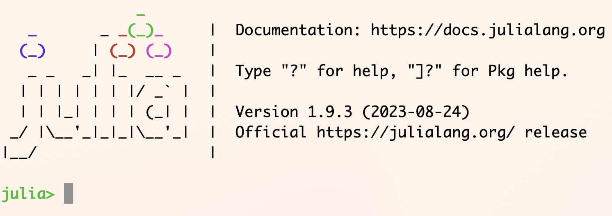

# What are evolution and textual transmission, and what do they have to do with code?

## Class preparation

### 1. Defining evolution and textual transmission

> **TBA**

### 2. Preparing to write code

This semester, we'll explore texts and biological data using the Julia programming language. If you have a computer, before coming to class, you should download and install Julia on your computer. If you don't have access to a computer, you will be able to use the machines in the Classics Department's research lab in Fenwick 406.  (Please speak with Prof. Smith if you would like to have access to the Fenwick 406 outside of regular work hours when the Classics Department Administrator can let you in.)

- Download Julia [here](https://julialang.org/downloads/)
- Follow these instructions to install Julia:
    - [installing Julia on Windows](https://julialang.org/downloads/platform/#windows)
    - [installing Julia on Mac OS](https://julialang.org/downloads/platform/#macos)
    - [installing Julia on Linux](https://julialang.org/downloads/platform/#linux_and_freebsd)

Throughout the semester, we will stress the importance of defining tests before we write code: how can we know if our code is functioning correctly?

To test whether you have installed Julia correctly, try to open a julia terminal (or REPL, for "Read-Evaluate-Print-Loop").  You should see something like this:

    
If you do, great!  At the `julia>` prompt, enter `exit()` to quit the REPL.

## In class

Bring a computer with you, and be prepared to open a Julia terminal or REPL.