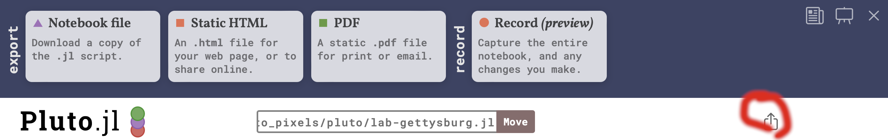
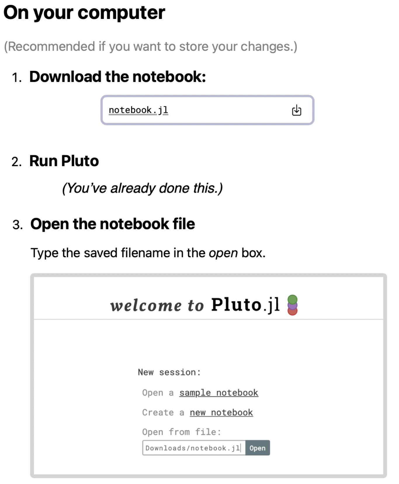

# Opening and saving notebooks in Pluto

## 1. Saving a notebook

You can use the "Export" button at the top right of your notebook, highlighted in red here:

    

Notice that you can save your notebook in different formats. 

- Choose "Notebook file" to save the file as notebook you can run in Pluto.
- Choose "Static HTML" to create a web page.
- Choose "PDF" to create a PDF.

Note that web pages and PDFs are static files: they may look exactly like a Pluto notebook, but they're not actually in Julia.

## 2. Opening a notebook saved as a web page

Our course web site includes that have been saved as web pages.  To download them as a Pluto notebook and run them on your machine, [run Pluto on your machine](../), then click the button  "**Edit** or **run** this notebook" at the top right of the web page.

You'll see a dialog box like the one illustrated here.  Follow the instructions labelled "On your computer."

