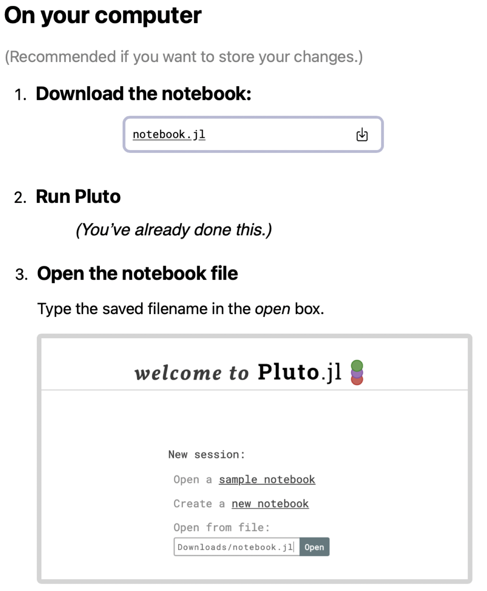

# Rhetorical style at Gettysburg

## Data structures

In your previous class preparation, you proposed a data model for comparing orations.   Read the following passage from an ancient handbook on rhetoric by Cicero, entitled *Ad Herennium* ("Guidebook to rhetoric for Herennius"): [selection from Cicero](./ad_herennium). Cicero proposes a kind of sliding scale of styles, from the "Simple" style at one end to the "Grand" style at the other, and gives examples of each, but doesn't tell us specifically what to look for in each example. We'll try to improve on Cicero by collecting specific, identified observations using the data model you developed for the previous class.

How should we collect those observations?  We could simply read Lincoln and Everett's speeches, and take notes.

But what if we wanted to apply our model more widely?  Would if we wanted to compare each of Lincoln's and Everett's speeches to a large corpus of nineteenth-century rhetoric? That change of scale might further suggest whether one or the other speaker at Gettysburg was more or less typical of contemporary oratory.  At some point, manually collecting observations is no longer feasible, and we need to learn how to automate that part of our work.  We need to write code that will collect our observations from a digital corpus.

At this point, we are translating *data models* into digital *data structures*.  In our first hands-on exercise in class, we will learn how to do that, and will begin to apply our digital implementation of your models to Lincoln and Everett's speeches.

## Assignment

Open [this web page](./lab-gettysburg.html), saved from a Pluto notebook you can use as a template for your work.

To get started working on your notebook, you'll need to run Pluto on your computer, and download the web page as notebook file you can open locally.

### Start Pluto on your machine

You should already have [installed Pluto on your machine](https://neelsmith.github.io/papyrus_to_pixels/techprereqs/). Then, in a Julia REPL, enter:

    using Pluto
    Pluto.run()

This will start up Pluto, and when Pluto is running, will open your default web browser.

### Save the web page and open it in Pluto

To save the template file on your local machine as a Pluto  notebook, first click the button  "**Edit** or **run** this notebook" at the top right of the web page.

You'll see a dialog box like the one illustrated here.  Follow the instructions under the heading "On your computer."

Once you have opened the notebook file with Pluto, you can run it and modify it.  When you want to save your work, you can use the "Export" button at the top right of your notebook, highlighted in red here:

    

Notice that you can save your notebook in different formats. We'll explore that option later in the semester. For your lab assignments, you'll use first open, "Notebook file."

### Requirements for satisfactory submission

1. Complete the template notebook.
2. Save your completed notebook using the "Notebook file" option. 
3. On your computer, ind the file you saved, and name it `{LASTNAME}-lab1.jl`, replacing `{LASTNAME}` with your last name.
4. Add the correctly named file to your personal folder on the course Google drive. 
    

