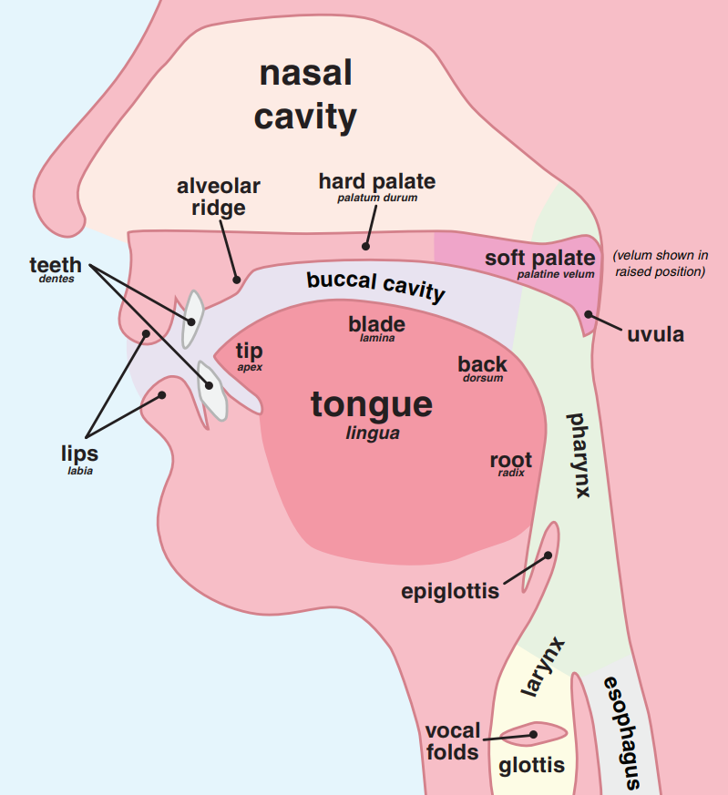

# Historical linguistics and phonology

## Similarities with linguistic and biological evolution

Historically observed:

- languages are always changing
- they *do* evolve into new languages

Hypothesized:

- do all languages descend from a common ancestor?

## Differences from biological evolution

- mechanism for introducing change?
- what guides selection?
- languages can borrow from or be directly influenced by other languages
- our "fossil record" (written text) is only 5,000 years old! 

(1-5 % of the time span of human language?)

## When are two languages different?

- mutual intelligibility -> dialects of a single language
- all our examples are clearly distinct languages

## How should we compare languages?

- *syntax*
- *vocabulary*
- *external historical information*

## Syntax: how words are arranged

- English: *word order* determines function
- Latin: *word form* determines function

Two English sentences with different subject and object:

> Dog bites man.
>
> Man bites dog.

Two Latin sentences with same subject and object:

> Homo canem mordet.
>
> Canem homo mordet.

> ## We're ignoring syntax!

## Vocabulary

*Cognates*: words in two languages that have the same origin (~ *homology*)

But pronounciation evolves! How do we identify cognates?

## Testing possible cognates

- similar meaning
- *systematic* correspondences in cognates of two languages
- change in pronounciation can be explained phonetically

## Phonetics

Simplistic model for our purposes:

- consonants only
- *where* the sound is made
- *manner* of producing the sound
- *vocalized* or not

### Where the sound is made

- *labial* (lips) (e.g., English `p`)
- *dental* (teeth) (e.g., English `t`)
- *palatal* (top of mouth) (e.g., English `k`)
- *velar* (top of mouth at back) (e.g., German `ch`)

---

### Manner of producing sound

- *plosive*: a little explosion of air (e.g., English `t`)
- *fricative*: a steady stream of air (e.g., English `th`)

### Vocalized

- *voiced*: vocal cords make a sound (e.g., English `d`)
- *unvoiced*: they don't (e.g., English `t`)

### Summary example

English `t`: *unvoiced dental plosive*
