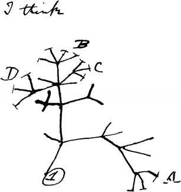
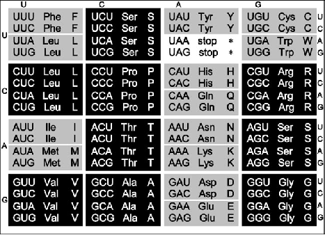
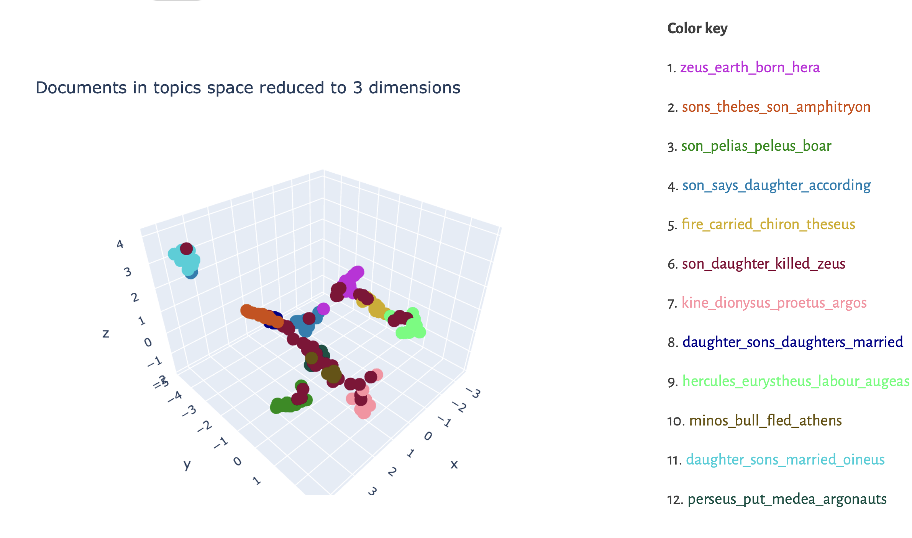

# Main course sections

- Modeling species and texts
- Classifying species and texts
- Modeling change through time

---

# Change through time: trees ?

---

Darwin, *On the Origin of Species*, 1859

---

Karl Lachmann, *Betrachtungen über Homer's Iliad*, 1837, and especially *De Rerum Natura: Libri Sex*, 1850.

---

# Change through time: something else?

---

---

Greek mythological narratives in a 12-dimensional topic space

