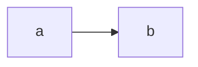

## Graphs

*Mermaid* is a plain-text syntax for describing structures like graphs.

The following block defines a graph with two nodes, `a` *and* `b`, related by an *edge*.

```mermaid
graph LR
a --> b
```