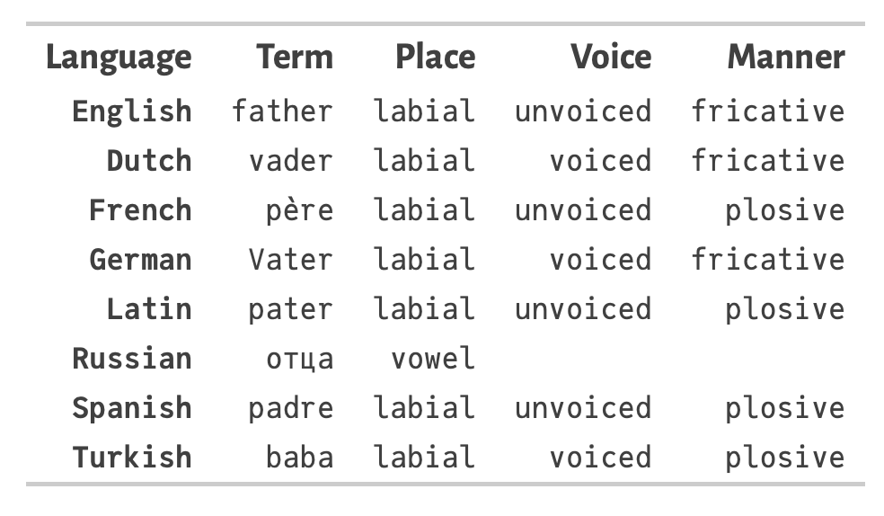
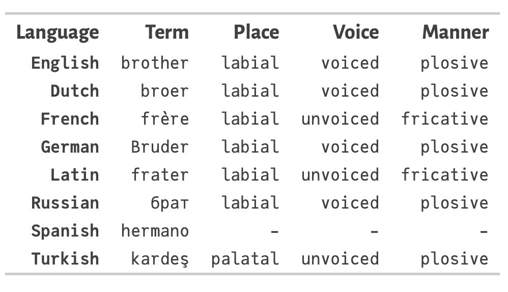

# Evolution of language

---

## About this exercise

- a lab exercise: true solution is known, but we are testing it with real data

> How often can you get meaningful initial results with *limited data*, *simplistic models* and *no advanced training*?

---

## Similarities with linguistic and biological evolution

Historically observed:

- languages are always changing
- they *do* evolve into new languages

Hypothesized:

- do all languages descend from a common ancestor?

---

## Differences from biological evolution

- languages can borrow from or be directly influenced by other languages
- our "fossil record" is only 5,000 years old! 

(1-5 % of the time span of human language?)

---

## When are two languages different?

> *England and America are two countries separated by a common language.*
>
> attributed to George Bernard Shaw

- mutual intelligibility -> dialects of a single language
- all our examples are clearly distinct languages

---

## How should we compare languages?

- *syntax*
- *vocabulary*
- *external historical information*

---

## Syntax: how words are arranged

- English: *word order* determines function
- Latin: *word form* determines function

Two English sentences with different subject and object:

> Dog bites man.
>
> Man bites dog.

Two Latin sentences with same subject and object:

> Homo canem mordet.
>
> Canem homo mordet.

---

> ## We're ignoring syntax!

---

## Vocabulary

*Cognates*: words in two languages that have the same origin

But pronounciation evolves! How do we identify cognates?

--- 

## How *not* to reconstruct word history

Cassiodorus (6th c. CE): guesses *barbarus* comes from *barba* ("beard") and *rus* ("countryside")

"Cling-clang etymology"

---

## Testing possible cognates

- similar meaning
- *systematic* correspondences in cognates of two languages
- change in pronounciation can be explained phonetically

---

## Phonetics

Simplistic model for our purposes:

- consonants only
- *where* the sound is made
- *manner* of producing the sound
- *vocalized* or not

---

### Where the sound is made

- *labial* (lips) (e.g., English `p`)
- *dental* (teeth) (e.g., English `t`)
- *palatal* (top of mouth) (e.g., English `k`)

---

### Manner of producing sound

- *plosive*: a little explosion of air (e.g., English `t`)
- *fricative*: a steady stream of air (e.g., English `th`)

---

### Vocalized

- *voiced*: vocal cords make a sound (e.g., English `d`)
- *unvoiced*: they don't (e.g., English `t`)

---

### Summary example

English `t`: *unvoiced dental plosive*

---

## Understanding phonetic evolution

- not random
- not all aspects of speech changed simultaneously

E.g., plural of English "roof":

- roo*f*s: *unvoiced labial fricative* (attested 1600, OED)
- roo*v*es: *voiced labial fricative*

---

## External historical information

- We'll consider *after* we develop a first tree based on phonetics

---

## Using our Pluto notebook

1. Examine our at least 6 features in our data set
2. Include "brother" and "kangaroo" in your features: look at as many others (minimum 4 others) as you like
3. Group languages together based on observations
4. Can you interpret the results as an evolutionary tree?

---

## Compare results

Conclusions?

Further accounting for observations?

---

## Phonetic context

| English | Dutch | German | Reconstructed ancestor |
| --- | --- | --- | --- | 
| **c**ook | **k**ooken | **k**uchen | k[aou] |
| **ch**urch | **k**erk | **K**irche | k[ei] |

---

## False cognates: Turkish `baba`

---

## Explaining false cognates

- coincidence?
- ~ analogical evolution?? 
    
*Lallwörter*: Turkish *baba*, English *papa*, Aramaic *abba*

--- 

## "Missing" cognate: Spanish `hermano`

--- 

## Explaining missing cognates

Meaning of words evolves, too!

*Generalization*

> Latin *germanus*: more specialized "full brother, brother by the same father"
>
> -> generalized in Spanish to "brother"

*Specialization*

> English *queen* 
> 
> - cognate with Greek *gunê* (γυνή), "woman"
> - reconstructed ancestor means "woman"

---

## Closing: a philosophical debate

- *diachronic reconstruction* 
- *synchronic system of correspondences*

---