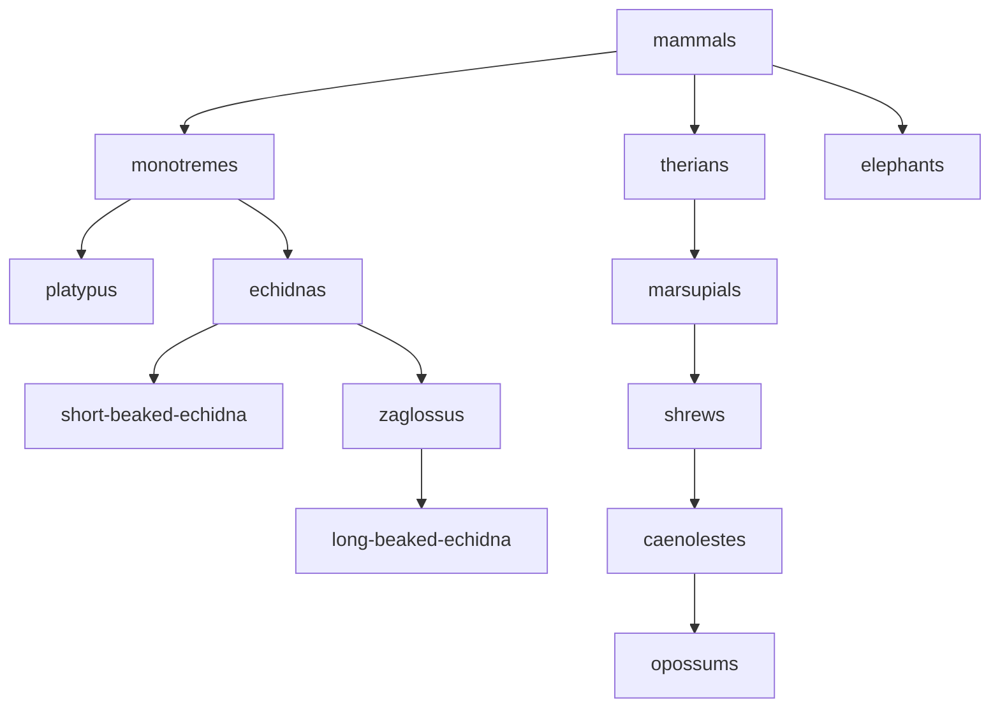

## An example of an evolutionary tree

Selection of the data from [this web site](https://vertlife.org/data/mammals/)

```mermaid
graph TD
mammals --> monotremes
monotremes --> platypus
monotremes --> echidnas
echidnas --> short-beaked-echidna 
echidnas --> zaglossus
zaglossus --> long-beaked-echidna

mammals --> therians
therians --> marsupials
marsupials --> shrews
shrews --> caenolestes
caenolestes --> opossums

mammals --> elephants

```